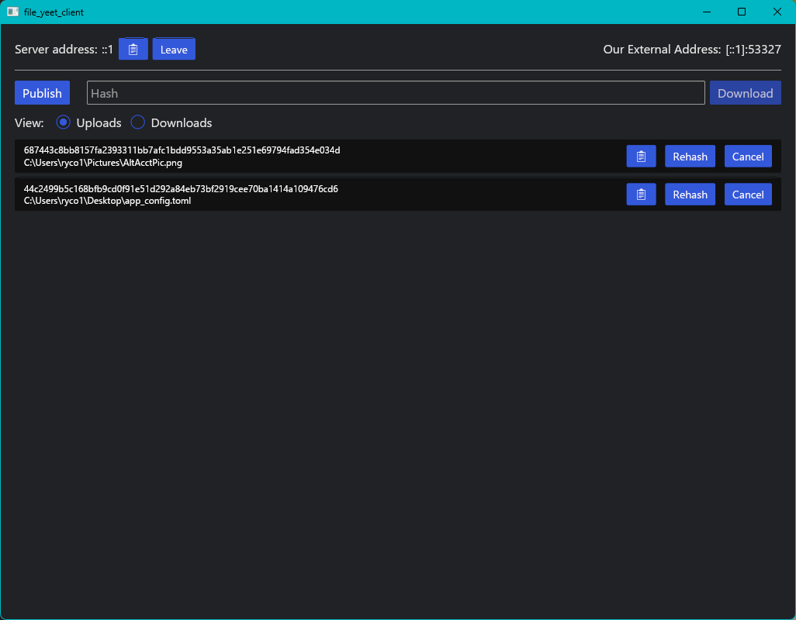

# File Yeet

A minimal client/server model to allow peers to share files directly by using a rendezvous server for peer discovery to establish a peer-to-peer connection.

Uses UDP hole punching and [port mapping techniques](https://crates.io/crates/crab_nat) to allow peers to transfer data directly. Special thanks to [TheOnlyArtz](https://github.com/TheOnlyArtz) for [this repo](https://github.com/TheOnlyArtz/rust-tcp-holepunch) because it served as a reference for hole punching techniques.

## Usage

### Server
```text
$ cargo r --bin file_yeet_server -- -h
The command line arguments for the server

Usage: file_yeet_server [OPTIONS]

Options:
  -b, --bind-ip <BIND_IP>      The IP address the server will bind to. The default is local for testing
  -p, --bind-port <BIND_PORT>  The port the server will bind to [default: 7828]
  -h, --help                   Print help
  -V, --version                Print version
```

#### Docker
I've also created a docker container specific to the server to simplify the deployment of the file yeet servers to different machines and clouds.
An official container build is available at `ryco117/file_yeet_server:latest`. However, a local container instance can be built with:
```bash
docker build -t file_yeet_server:local .
```
**Note**: The docker container must be run with `--net=host` to ensure that the container has visibility of the client's IP address, instead of a docker intermediary.


### Client

```text
$ cargo r --bin file_yeet_client -- -h
The command line interface for `file_yeet_client`

Usage: file_yeet_client.exe [OPTIONS] [COMMAND]

Commands:
  pub   Publish a file to the server
  sub   Subscribe to a file from the server
  help  Print this message or the help of the given subcommand(s)

Options:
  -s, --server-address <SERVER_ADDRESS>
          The address of the rendezvous server. Either an IP address or a hostname
  -p, --server-port <SERVER_PORT>
          The server port to connect to [default: 7828]
  -x, --external-port-override <EXTERNAL_PORT_OVERRIDE>
          Override the port seen by the server to communicate a custom external port to peers. Useful when manually port forwarding
  -i, --interal-port <INTERAL_PORT>
          Require the client to bind to a specific local port. Useful when manually port forwarding
  -g, --gateway <GATEWAY>
          The IP address of local gateway to use when attempting the Port Control Protocol. If not specified, a default gateway will be searched for
  -n, --nat-map
          When enabled the client will attempt NAT-PMP and PCP port mapping protocols
  -h, --help
          Print help
  -V, --version
          Print version
```

## License
This project is licensed under the MIT license.
